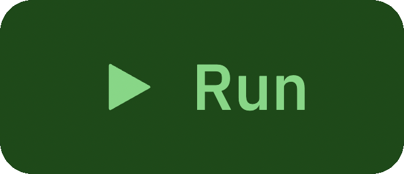
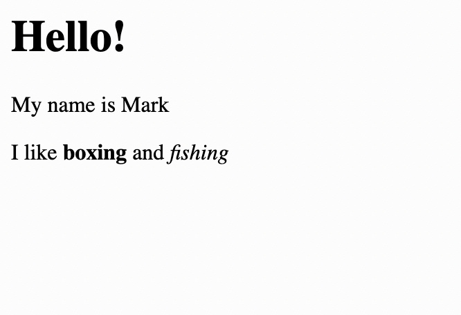
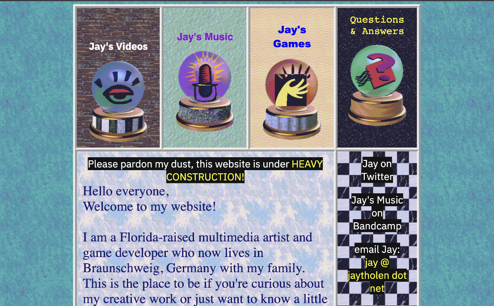
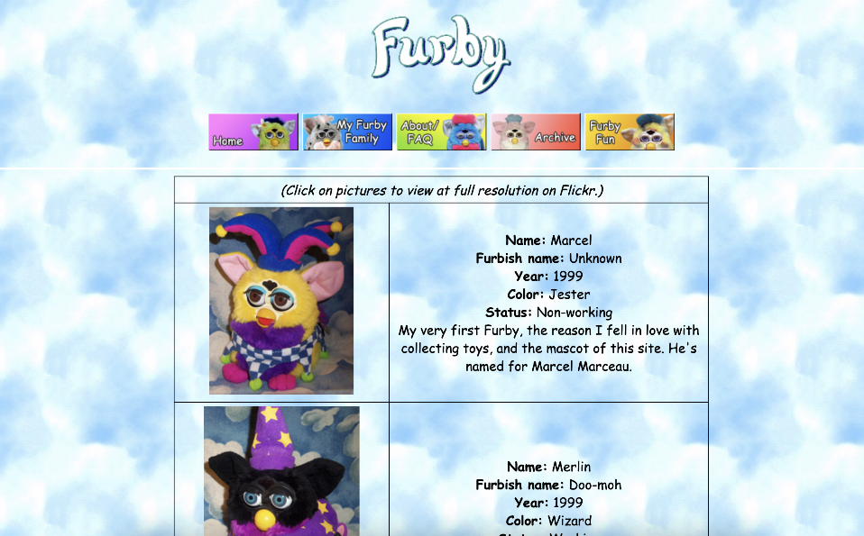
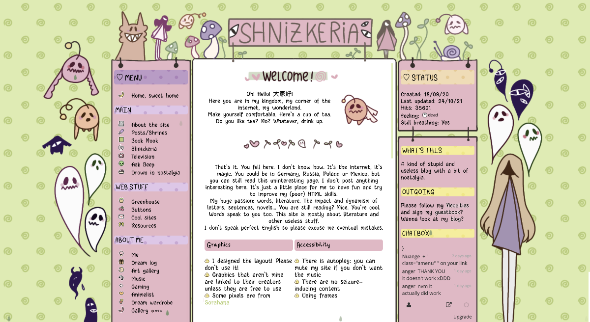
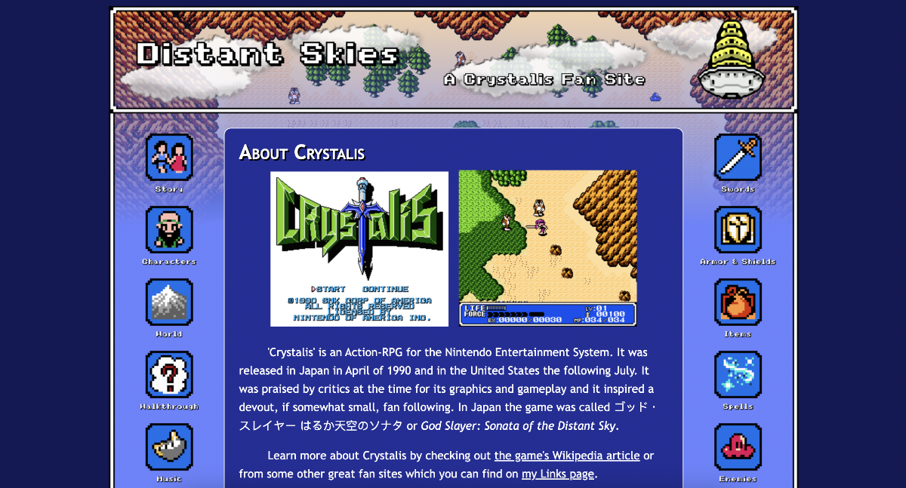

# 1. Making Websites with HTML and CSS


### Replit Workspace

There will be 3 parts we interact with the most in the workspace: 
- **Code editor**
- **Run button**
- **Output pane**

Code is written in the **code editor**:

```html
<h1>Hello!</h1>
<p>My name is Mark</p>
<p>I like <b>boxing</b> and <i>fishing</i></p>
```

Let's see what this code does. Smash this **run button**:



You should see something like this pops up on the right side in the **output pane** after you push the run button:



This is the content of our web page! 

#### Each module with have:
  - learning goal
  - video to guide you
  -  👉 TRY IT : ...... (a chance for you to try the coding tasks)
  -  check your code by choosing "See what Mark did"
  - summary of the video
    
### Examples of what you can make on Replit!

[](https://jaytholen.net/)
[](https://myfurbyworld.neocities.org/)
[](https://nuange.neocities.org/)
[](https://distantskies.neocities.org/)

