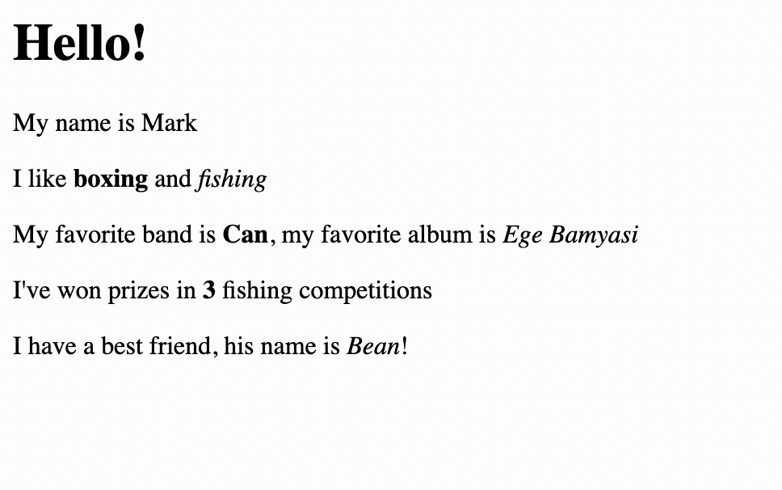
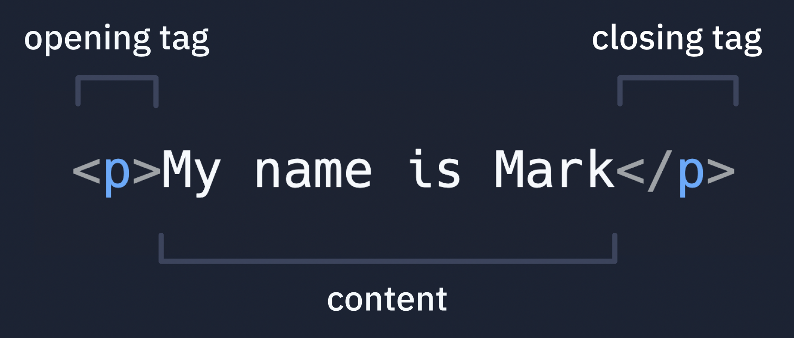

# 2. Adding Some Text

**Learning Goal**:
1. Understand tags and how they work in HTML.
2. Discover how to add text to a webpage.

**Time**: 10 mins


## 👉 TRY IT : ......

1. Change 'Mark' to your own name
2. Change the hobbies to match yours
  
```html
<h1>Hello!</h1>
<p>My name is Mark</p>
<p>I like <b>boxing</b> and <i>fishing</i></p>
```


3. Add more lines of text to tell people more about you (favorite music / anime, achievements etc). The sky's the limit!
4. Use **Bold** and _italic_ text to highlight important stuff.
5. Add some of these as other ways to present your text:

  - `<h2>`, `<h3>`, `<h4>`, `<h4>`, `<h5>`, `<h6>` for other header variants
  - `<small>` for smaller text
  - `<u>` to underline text
  - `<mark>` to highlight text
  - `<del>` to cross over words
  - `<sub>` and `<sup>` to render text as subscript / super script


<details>
<summary>See what Mark did:</summary>

Here's what Mark has:

```html
<h1>Hello!</h1>
<p>My name is Mark</p>
<p>I like <b>boxing</b> and <i>fishing</i></p>
<p>My favorite band is <b>Can</b>, my favorite album is <i>Ege Bamyasi</i></p>
<p>I've won prizes in <b>3</b> fishing competitions</p>
<p>I have a best friend. His name is <b>Bean</b></p>
```


 
</details>

## Let's summarize
- `<h1>` is a **first level heading** that is used for big, bold text that you want to stand out (like a title) and `<p>` tags are used for paragraphs.
- The letter inside the tag often implies what the tag does (`<b>` for bold, `<i> for italic`). Read more about tags on the [W3 schools doc](https://www.w3schools.com/TAgs/default.asp).
- Almost all tags in HTML have opening and closing pairs: `<<h1></h1>`, `<p></p>`, `<b></b>`.
- To refresh the code, click the refresh button below the `output` button or choose `run`.





### Now let's add some images!
