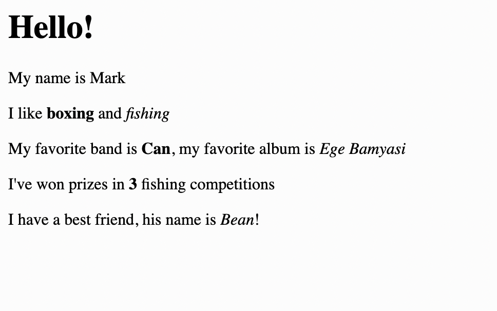

# 3. Images

**Learning Goal**:
1. Learn how to add an image to your repl.
2. Discover how to manage files.
3. Share your website url with others.

**Time**: 10 mins


## 👉 TRY IT : ......
1. Add this line to the end of your code:

```html

```

You should see Mark's face popping out. (Yes, at Replit we call this little guy *Mark*)


2. Try to achieve this:


<details>
<summary>See what Mark did:</summary>

```html


```

</details>


3. Look at the sidebar on the left side. You are currently in the `Tutorial` (the icon with the book).
4. The second icon (page with the folded corner) is the `files` tree.
5. Click on `Files` to see what it looks like and then come back here (to `Tutorial`)
6. `Files` is where we store all our files.
7. You can see we're currently editing `index.html`, which is the code for our web page, and there's a `mark.png`, which is the image we just imported.


8. Upload your image (drag it into the file or choose `add file`) and rename it..
  


9. After uploading your own image, change the `
```


11. Add a description of the image using `alt` and add `width` and `height`. 

```html

```
<details>
<summary>See what Mark did:</summary>

Here's what Mark has:

```html
<h1>Hello!</h1>
<p>My name is Mark</p>
<p>I like <b>boxing</b> and <i>fishing</i></p>
<p>My favorite band is <b>Can</b>, my favorite album is <i>Ege Bamyasi</i></p>
<p>I've won prizes in <b>3</b> fishing competitions</p>
<p>I have a best friend. His name is <b>Bean</b></p>

```


 
</details>

12. You have a working website already! Share it with others. Click the URL in the webview header and copy and share it with people.


## Check out this Replit user:
Check out this [Repl link](https://replit.com/@slmjkdbtl/lilfang) to see a new user's [photo album of my cat lil fang](https://lilfang.slmjkdbtl.repl.co/) created using only what we have learned:


## Let's summarize:
- You can drag and drop an image into the files pane (or choose `add file` icon). Make sure the name of your image and the source are listed (jpg, png, gif, etc.).
- `` allows you to add text that matches the image (this helps people who use a screen reader and can't see the image).
- The `width=` and `height=` can be adjusted for your image.
- Open and share your website using the link in the `output` pane.


> Don't forget to add quotation marks around attribute values!
>
> -- Amjad Masad, CEO man

### Now let's learn how to add links!