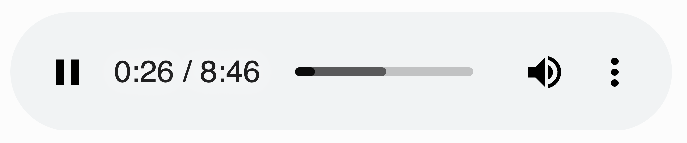
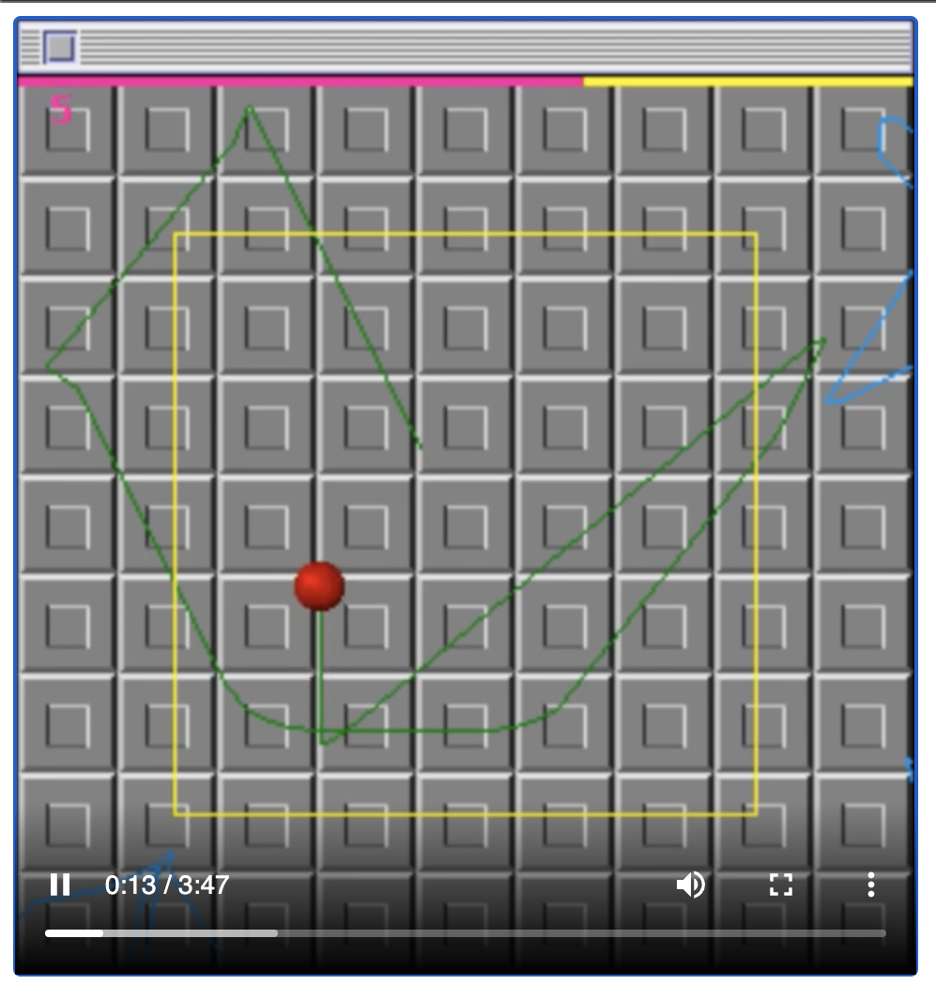
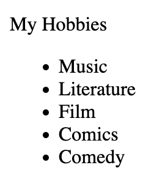

# 5. Some Other HTML Tags

**Learning Goals**:
1. Learn how to add audio files to your webpage.
2. Add videos to your webpage.
3. Create bulleted and numbered lists.


**Time**: 10 mins


## 👉 TRY IT : ......
### Adding Audio
- Use `<audio>` tag to add sound to your webpage (make sure you upload the file to your file tree first).


```html
<audio src="mysong.mp3"></audio>
```


1. Add the code below to your `<audio>`  tag to add a controller.

```html
<audio src="mysong.mp3" controls></audio>
```




2. Add this code to your `<audio>` tag for the audio to autoplay/loop:

```html
<audio src="mysong.mp3" autoplay loop></audio>
```

### Adding video

3. Use `<video>` tag to add a video to your webpage (make sure you upload the file to your file tree first).

```html
<video src="myfilm.mp4"></video>
```


4. Adding controls, autoplaying, and looping for a video is done in the same way as `<audio>`:

```html
<video src="myfilm.mp4" controls autoplay loop></video>
```

This will give us something like




### Lists

5. Add an unorderd list (bulleted list) to your code using `<li>` for each item inside a `<ul>`.





6. Change `<ul>` to `<ol>`. You'll get a numbered list. 

<details><summary>See what Mark did:</summary>
  
```html
<p>My Hobbies</p>
<ul>
    <li>Music</li>
    <li>Literature</li>
    <li>Film</li>
    <li>Comics</li>
    <li>Comedy</li>
</ul>
```
</details>

## Let's summarize:
- Use `<audio>` tag to add sound to your webpage and `<video>` for videos (make sure you upload the file to your file tree too with the same name).
- `<audio>` and `<video>` won't autoplay so make sure you add `controls>` so you have a play button.
- You can add `autoplay loop>` to your `<audio>` or `<video>` too.
- Adjust the `width=` and `height=` of your video to make it larger or smaller.
- Create an unordered list (bulleted list) using `<li>` (**l**ist) for each item inside a `<ul>` (**u**nordered **l**ist).
- Change `<ul>` to `<ol>` (**o**rdered **l**ist) for a numbered list. 


## Next, finally, we're going to be adding colors and styles to our page!