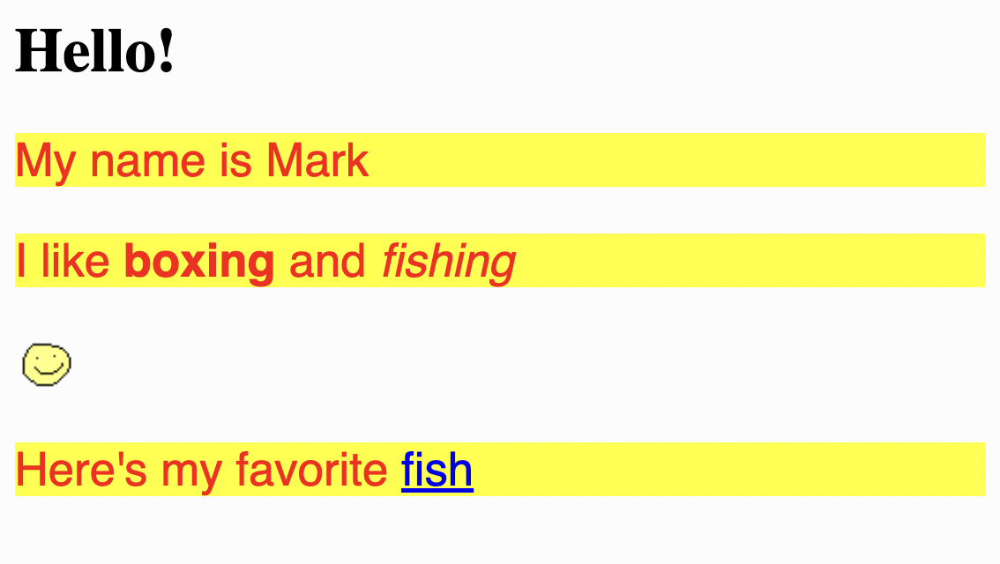
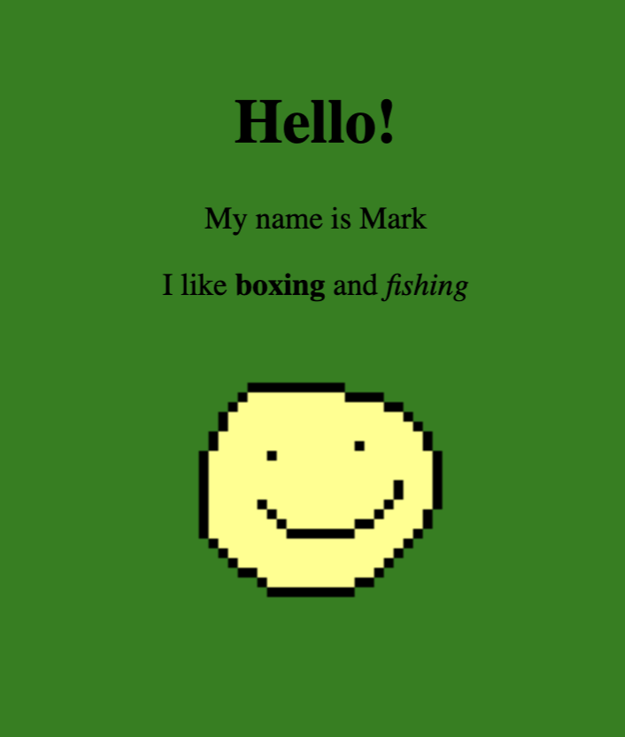
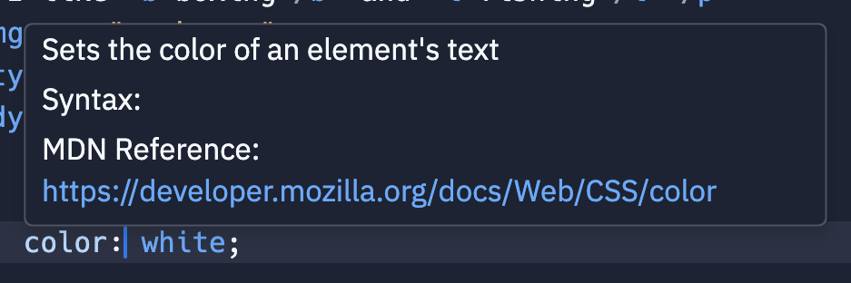
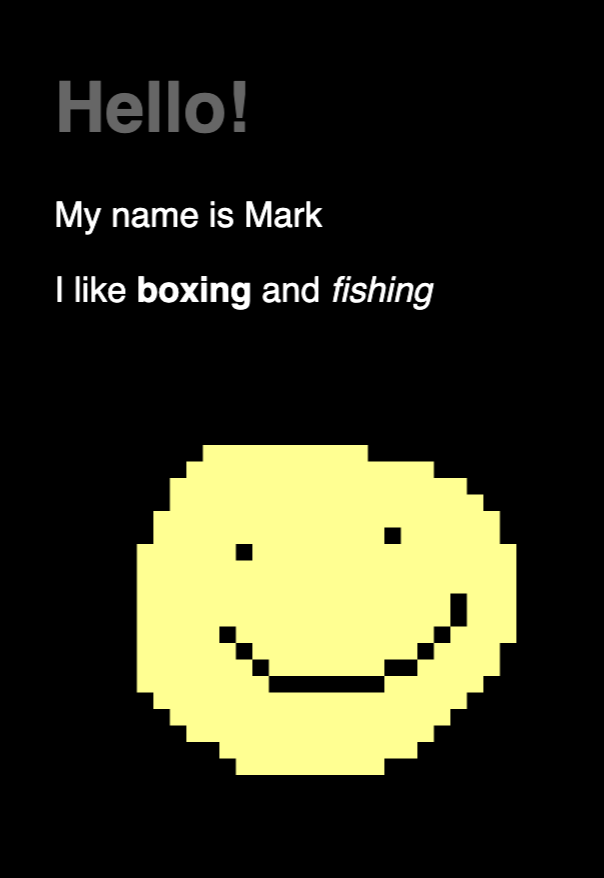
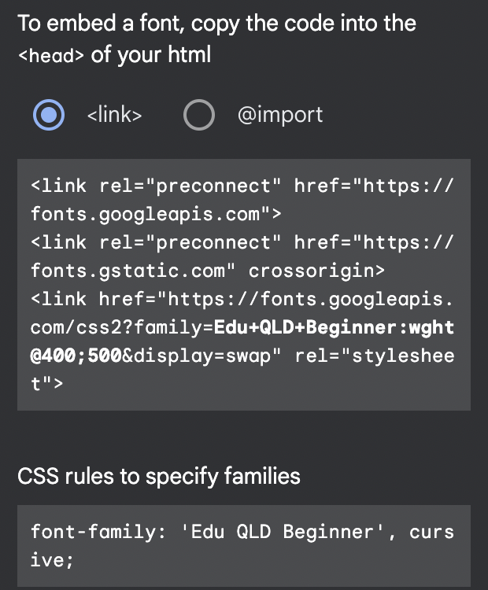

# 6. Adding Styles
**Learning Goal**:
1. Learn how to style a page using `<style>` tag and a language called **CSS**.


**Time**: 5 mins


To style a page we're going to use `<style>` tag and a language called **CSS**.

## 👉 TRY IT : ......
## Challenge #1: Guess what this does?

Append this to the end of your code

```html
<style>
p {
	font-family: sans-serif;
	font-size: 24px;
	color: red;
	background-color: yellow;
}
</style>
```

and guess what it'll do to your web page

<details>
<summary>Reveal</summary>
	

</details>

## Observe

Try to figure out how the new code matches the changes to our web page. 

- What does `p` mean here?
- Why the `<h1>` isn't styled, only the `<p>`?
- How does each line in the curly braces `{}` control the styles on screen?

## Explanation

We write **CSS** (**C**ascading **S**tyle **S**heets) code inside `<style>` tag. The syntax of CSS looks like this:

```css
selector {
	key1: value1;
	key2: value2;
	key3: value3;
}
```

- **Selector**: what elements do the following styles apply to (e.g. `p` means applying to all `p` tags). 
- **Key**: name of the style rule
- **Value**: value of the style rule

**Note**: All styles are enclosed by curly braces `{` `}`

In the code we tried above

```css
p {
	font-family: sans-serif;
	font-size: 24px;
	color: red;
	background-color: yellow;
}
```

We're defining some styles for all elements with `<p>` tag, and we're changing the following style rules:

### font-family

To change the font of text.

There are several browser built-in fonts to use, try these out and pick one you like:
- `sans-serif`
- `serif`
- `monospace`
- `cursive`
- `fantasy`

### font-size

To change the font size of text. `24px` means our font size is **24 pixels**. Try change that  to an extremely small and an extremely large value.

### color

To change the color of the foreground (mainly text). Here we're using browser [built-in color keywords](https://developer.mozilla.org/en-US/docs/Web/CSS/color_value/color_keywords) like `red` and `yellow`, but there's a [variaty of format you can use](https://developer.mozilla.org/en-US/docs/Web/CSS/color_value), if you want to use custom color you'll have to use another format like hex code or RGB code!

### background-color

Similar to `color` but for background.

## Styling Other Tags

Try styling other elements! For example

```css
img {
	width: 160px;
	margin: 24px;
}
```

- turns all images to `300` pixels wide
- added a `24` pixel margin to surrounding elements

```css
body {
	background: green;
	padding: 64px;
	text-align: center;
}
```

- changes background color of the whole page to `green`
- have a `64` pixel padding around the page
- makes everything aligned to center



### Tip

You can hover over a piece of code to get help on what the code means.



## Challenge #2: Make the page dark-themed

Make this:



<details>
<summary>See what Mark did</summary>

```html
<style>
body {
	background: black;
}
p {
	color: white;
}
h1 {
	color: grey;
}
</style>
```

</details>

## Tip: Using Custom Font

If you want to use some custom font Google font is an easy way

1. Go to https://fonts.google.com/
1. Find a font you like
1. Click "Select this style"
1. Paste the first code block to your `.html` file
1. Paste the second code block to your CSS rule



## There are lots of styles

There are hundreds of CSS style rules and we only mentioned a few! If you have something in mind you want to achieve, try google search `How to do ... in CSS`, you can also browse the giant [MDN Reference](https://developer.mozilla.org/en-US/docs/Web/CSS/Reference)