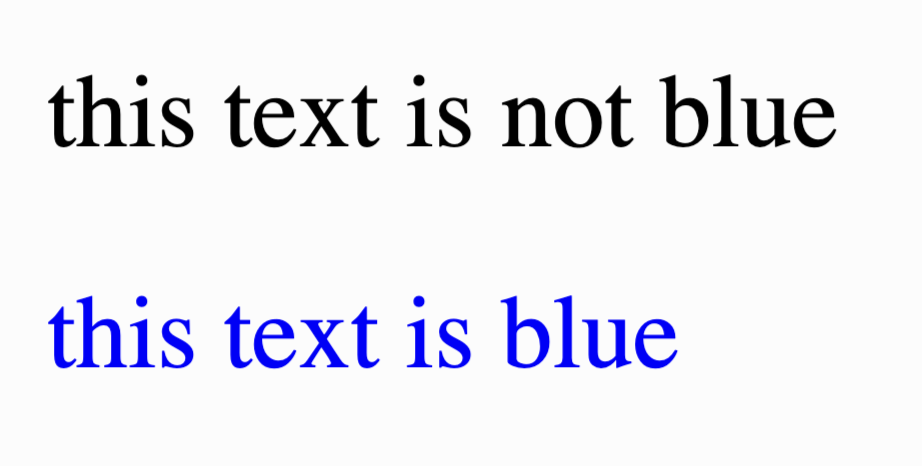

# 7. Styling Individual Elements

What if we want to style a single element instead the whole group? We're going to use another type of selector here, the **ID selector**.

Try running this piece of code

```html
<style>
#funkytext {
	color: blue;
}
</style>

<p>this text is not blue</p>
<p id="funkytext">this text is blue</p>
```

Guess what'll happen?

## Explanation

`#funkytext` is a selector just like the tag selector `p` and `body`, but instead it only matches with one element on the page who has the attribute `id` set to the ID name.

So in this case, it'll only style the second line of text.



Note that you can only apply `#funkytext` to one element, if you want to style multiple elements but don't want to style the whole tag, we'll use **Class Selector**

## Class Selector

```html
<style>
.serioustext {
	font-family: fantasy;
}
</style>

<h1 class="serioustext">this is a serious header</h1>
<p>this is a not serious text</p>
<p class="serioustext">this is a serious text</p>
```

Noticed the difference? Guess what this code would do!

<details>
<summary>Reveal</summary>


 
</details>

## Explanation

`#funkytext` is an **ID Selector**

`.serioustext` is a **Class Selector**

| | ID Selector | Class Selector |
| ----------- | ----------- | -- |
| Can be applied to multiple elements? | No | Yes |
| How to assign to an element | `<a id="name">` | `<p class="name">` |
| CSS Syntax | `#name { ... }` | `.name { ... }`

You can say **CLass Selector** is a superior form because it just can be applied to multiple elements, and it is used much more common than **ID Selector**. Only use **ID Selector** if you're sure it's only going to be applied to one element!