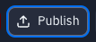
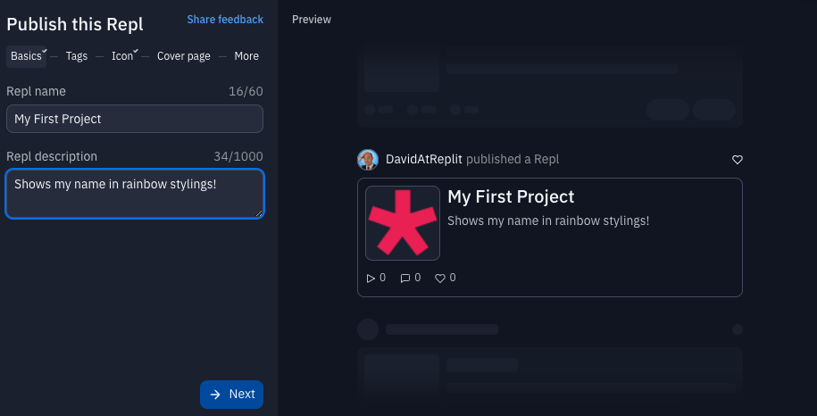
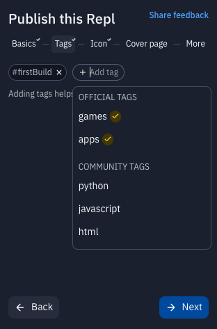
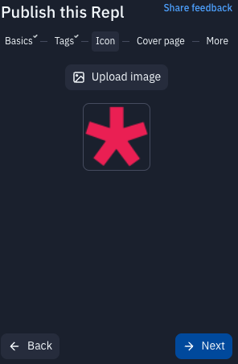
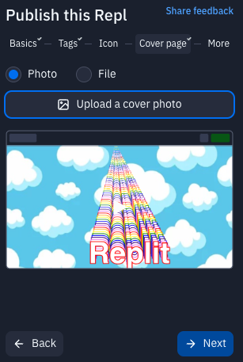
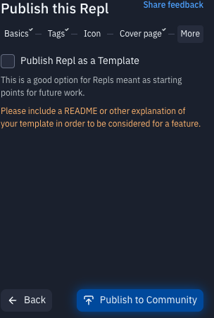

# 9. It's Sharing Time!
**Learning goals**: 
1. Learn how to publish your repl and share it with others

Time needed : 5 mins

##  👉 TRY IT : ......

- Hit that **publish** button on the top right
- Give your project a name and a description

- Add a hashtag like **#firstbuild** so people in the community can find it when they search

- Upload any image you want for the icon... 

- and cover photo...

- No need to publish as a template, so just click  **Publish to Community** button at the bottom and you've done it!

# What about my friends?

Want to share it directly with people you know? Just copy the address on the bar on the right and send it to whoever you want!

## Let's summarize:
- Don't be shy - the community loves it!
- You can add hashtags so the community can search for your work.
- Add a fun image for the icon and cover album.
- No need to publish as a template, so just click the ** Publish to Community** button at the bottom.

## Congrats on building a website 🎉